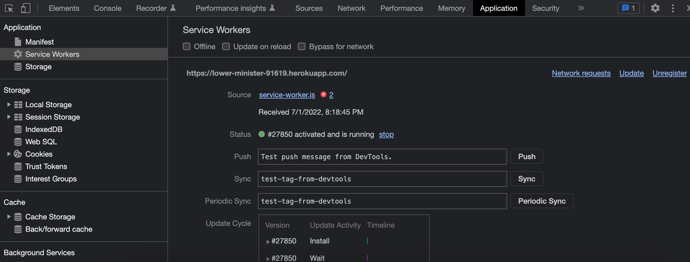
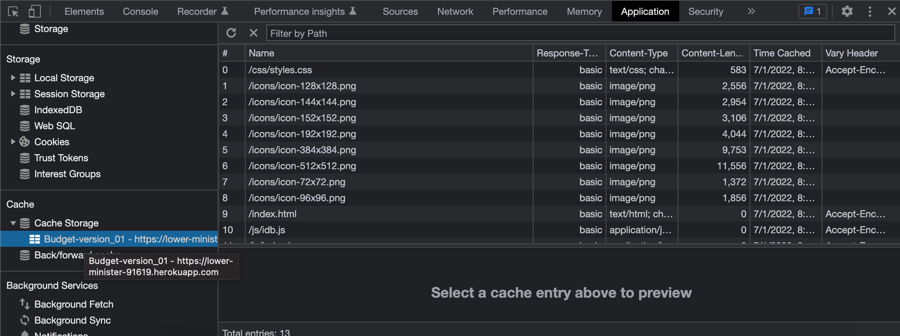

# budget-tracker

## User Story
AS AN avid traveler

I WANT to be able to track my withdrawals and deposits with or without a data/internet connection

SO THAT my account balance is accurate when I am traveling 

## Functionality
When a user adds or removes funds the graph below is updated accordingly. 

The information on the website as well as the interface is all cached.

This information is saved in the case of of poor or lack of internet thanks to the servicer worker.

## Preview of Application
### Service Worker

### Cache Storage

## URLs

GitHub Repo:

https://github.com/randronaco1027/budget-tracker

Heroku:

https://lower-minister-91619.herokuapp.com/